<style>
img.float-left { float: left; }
</style>

```{r knitr_option, include=FALSE}
knitr::opts_chunk$set(cache = TRUE, results="hide", message=FALSE, warning=FALSE)
```

<div class="alert alert-info">
Kondo, K. "<b>Simulating the Impacts of Interregional Mobility Restriction on the Spatial Spread of COVID-19 in Japan,</b>" Preprint at medRxiv. (2020) <br>
https://doi.org/10.1101/2020.12.28.20248926
</div>


# Simulation Results

## Degree of NPIs


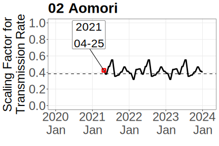
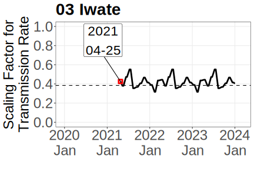


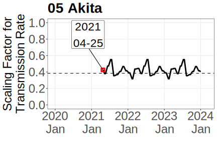


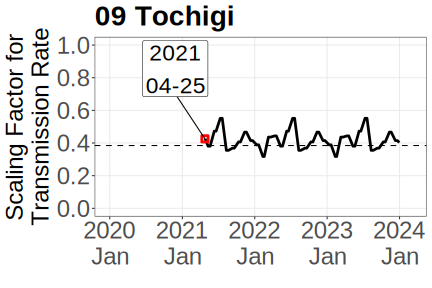


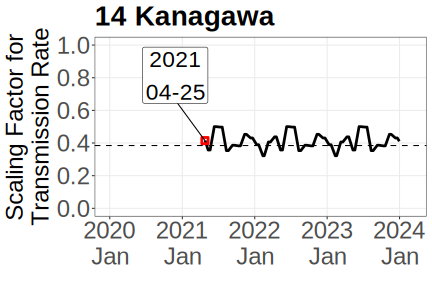


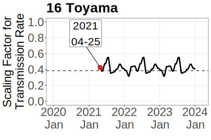

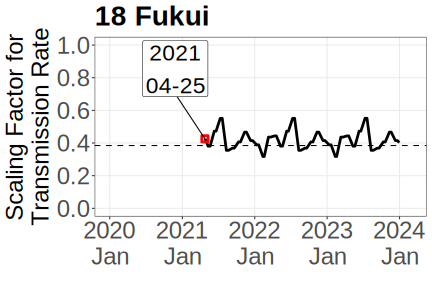
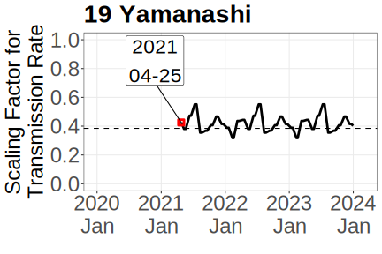


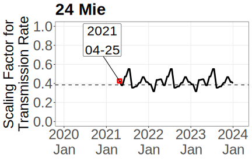

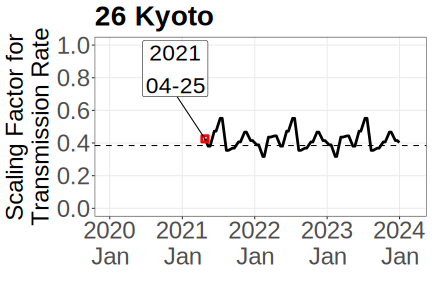


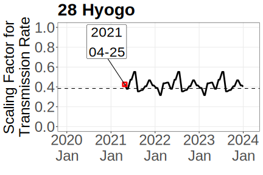


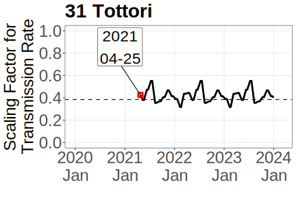


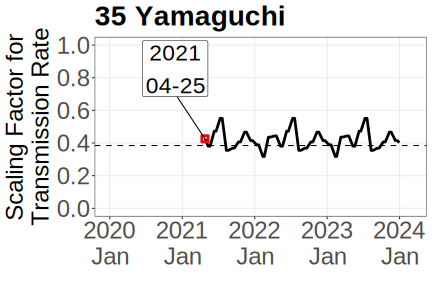


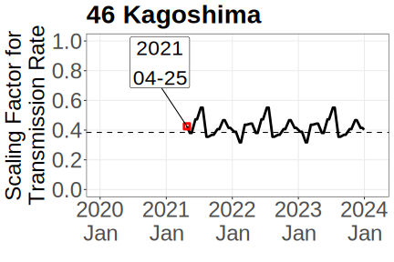


## Daily Number of Infection


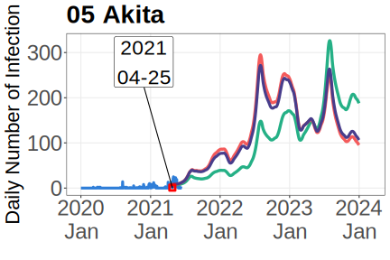


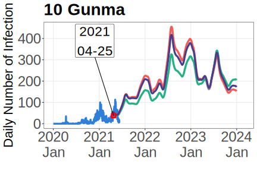
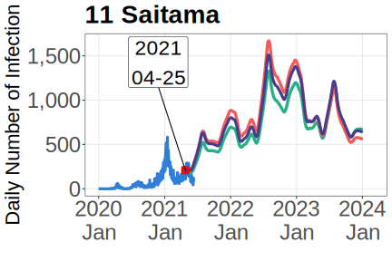


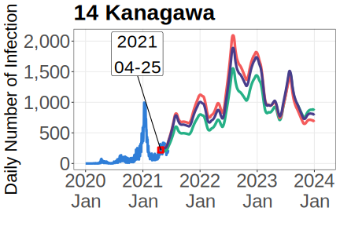
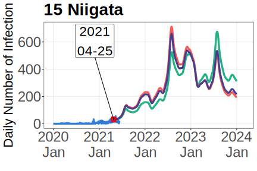

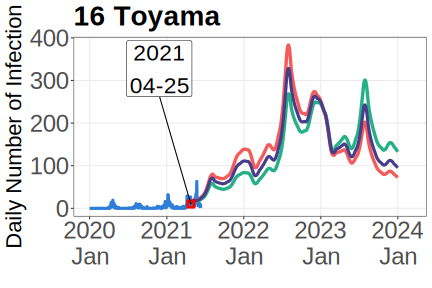


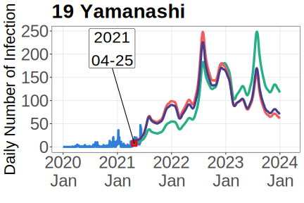


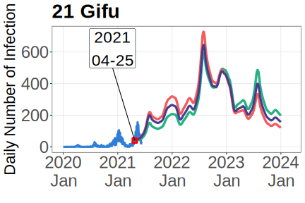
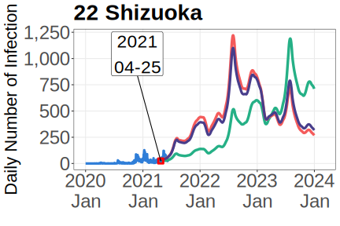


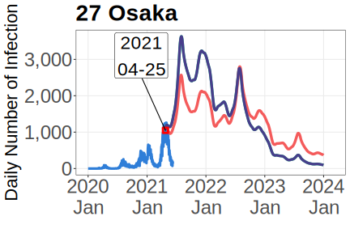

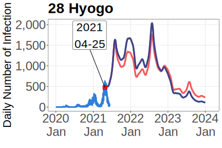


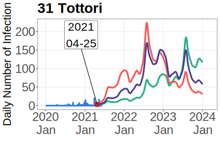

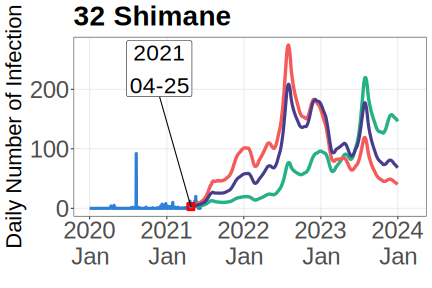
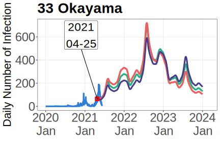

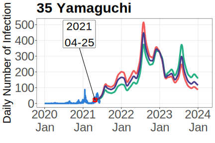

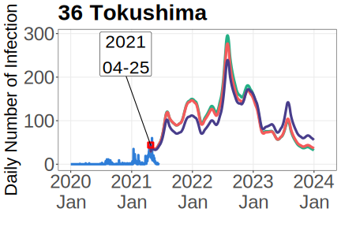


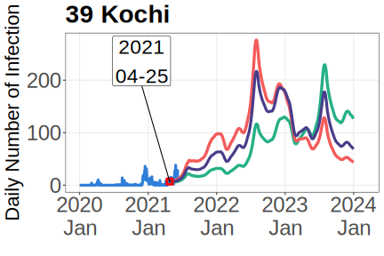

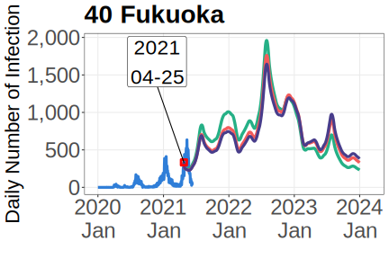
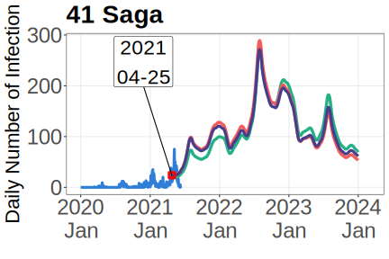
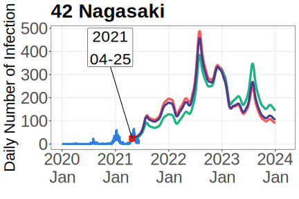


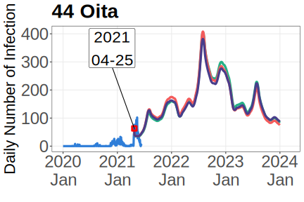
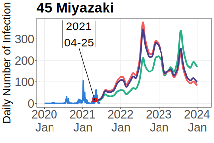
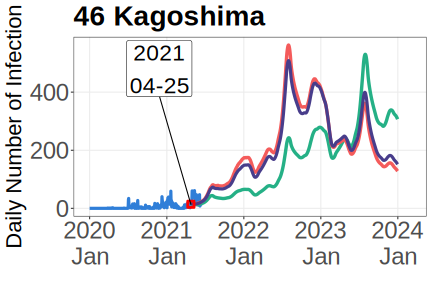


## Number of Infectious Individuals

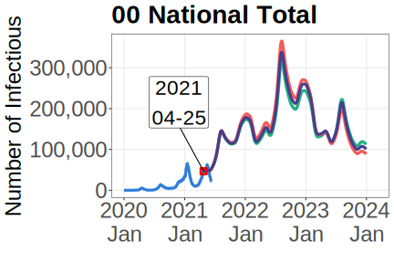

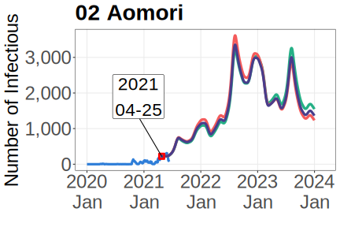


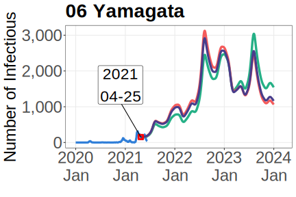
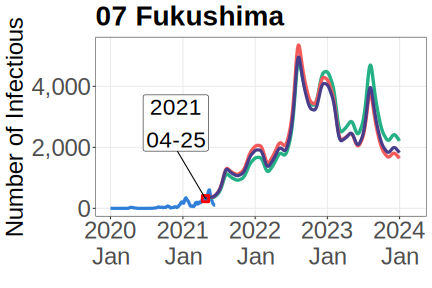

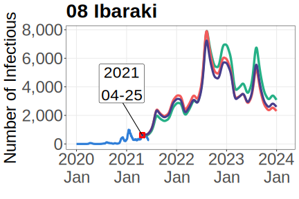
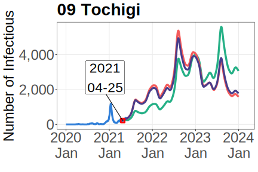

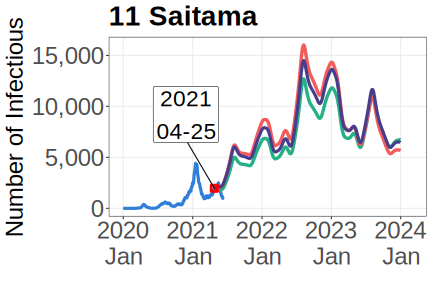

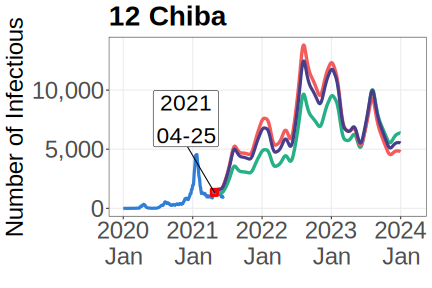


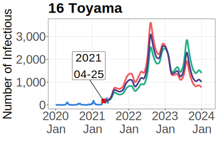

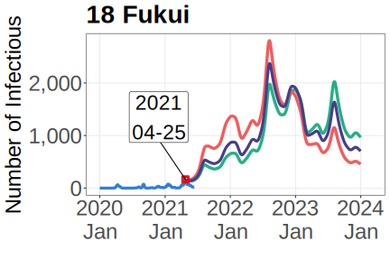


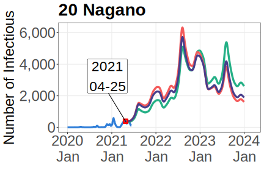
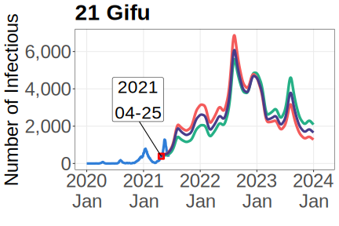

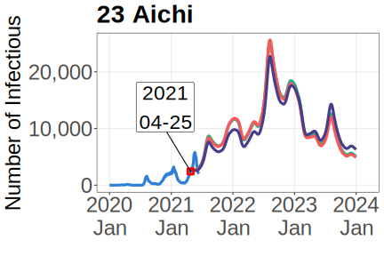


## Ratio of Daytime and Nighttime Force of Infection


